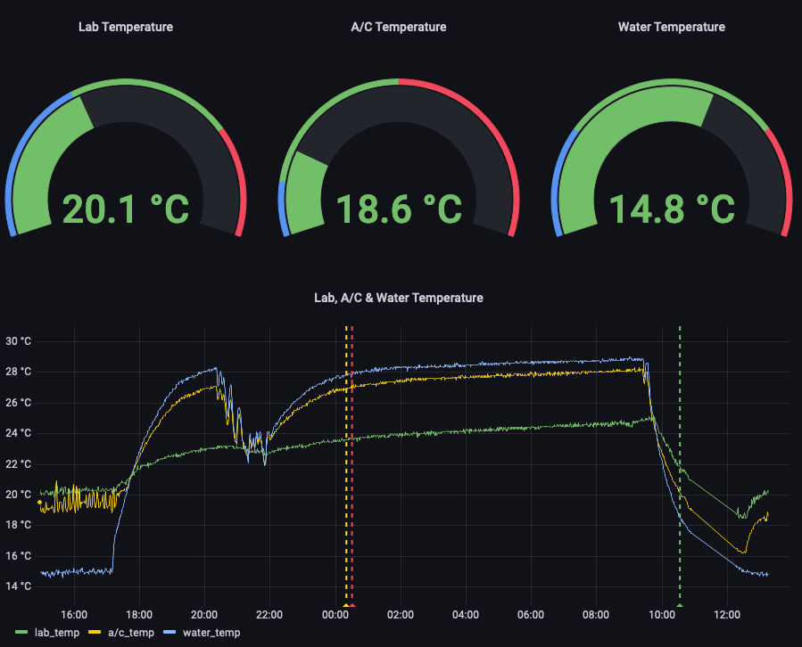

# Experiment Monitoring Software

A software package for automated monitoring of lab equipment, including time series visualization and automatic e-mail alerts.

## Architecture

A central server gathers data from different sources, writes them into a database, hosts a graphic interface for visualization and sends automatic alert e-mails based on user-defined criteria.

## Currently supported interfaces

  * Serial (e.g. Pfeiffer TPG261)
  * TCP/IP (e.g. Arduino Due)
  * Analog [via ADC on Arduino Due] (e.g. Pfeiffer TPG300)
  * SNMP (e.g. Eaton UPS)
  * Phidgets (e.g. Thermocouple module)

## Setup

  * Before starting the Experiment Monitoring, you need to set up your server. For hardware requirements & the step-by-step server setup procedure, see `docs/server_setup.md`.
  * ADC setup: See `src/expmonitor/classes/adc/adc_setup.md`. Only needed if you want to monitor analog signals.
  * Working with existing interfaces:
    - `src/expmonitor/config.py` is all you need to modify.
  * Adding your own interfaces:
    - Write a subclass that extends the abstract `Sensor` class defined in `src/expmonitor/classes/sensor.py` to drive your sensor/equipment and instantiate it in `src/expmonitor/config.py`.

## Guide to the repository structure:

  * `src/expmonitor/calibrations`: Contains calibration data and scripts for all calibrated equipment.
  * `src/expmonitor/classes`: Contains driver classes for all interfaces. Put your new driver classes in here.
    * `src/expmonitor/classes/sensor.py`: Abstract base class for individual sensor classes.
    * `src/expmonitor/classes/adc`: Contains Arduino sketch, its Python Class and its setup guide.
    * `src/expmonitor/classes/ups`: Implements EatonUPS Class for batteries and their setup guide.
  * `tests`: Contains tests for the Phidget class.
  * `src/expmonitor/utilities`: Contains interface-independent classes to be used by all sensors.
    * `src/expmonitor/utilities/spike_filter.py`: Spike filter for instances of Sensor subclasses. Enable in `src/expmonitor/config.py` by setting `sensor.spike_filter.spike_threshold_perc` for any given sensor.
  * `src/expmonitor/config.py`: Main configuration file.
  * `src/expmonitor/exec.py`: Main execution file for Linux service and command line execution. Use it to test single or multiple (e.g. <i>5</i>) iterations of the data acquisition cycle:
    <pre>
    python3 /mnt/code/experiment-monitoring/src/expmonitor/exec.py t v <i>5</i>
    </pre>
    Note that the argument after the the script filepath sets the number of executions of the loop. The t and v flags enable timing and exception traceback to stdout.
